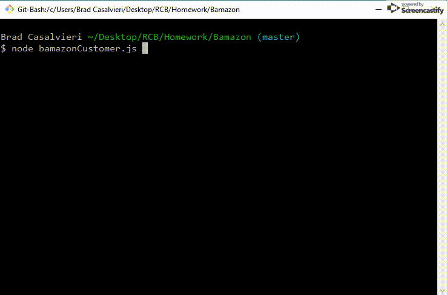
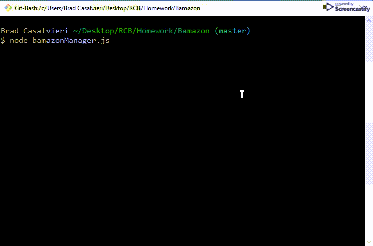
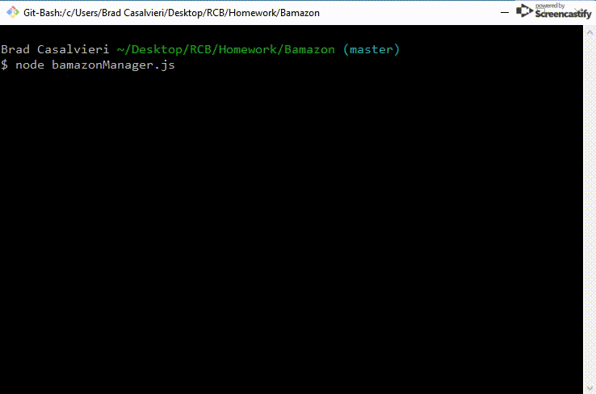

# Bamazon
Rutgers Coding Bootcamp Node.js & MySQL Homework

## Description
The Bamazon app has two portals - Customer and Manager. The Customer can view all products for sale and make a purchase. The Manager can view all items, view items with low inventory, add to inventory, and add a new product.

## Technologies Used
- Node.js
- MySQL

## How to Use - Customer View
When the customer logs in, he/she see a list of all items for purchase, selects the desired item by ID number and enters a quantity. The app will calculate a total cost for the purchase.

If the customer desires a quantity that is greater than the stock quantity available, the user will be alerted with a message of "Insufficient Quantity."

## How to Use - Manager View
The manager can select one of the following options:
1. **View Products for Sale**

2. **View Low Inventory**: view all products with a stock quantity of 5 or less

3. **Add To Inventory**

4. **Add New Product**

## License
MIT © Brad Casalvieri